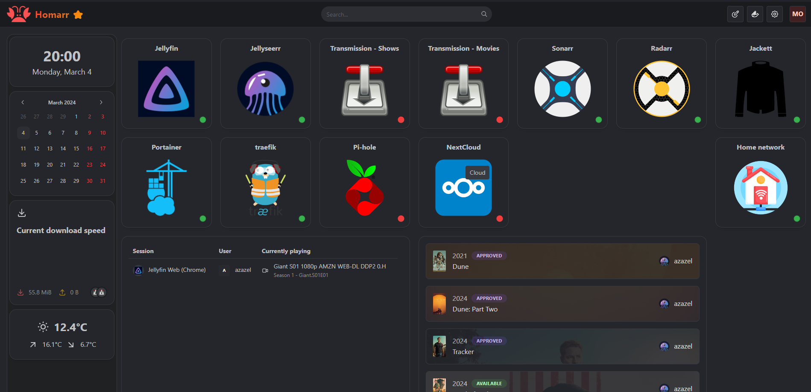
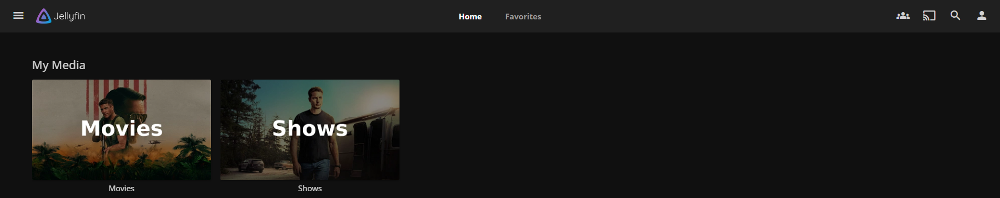
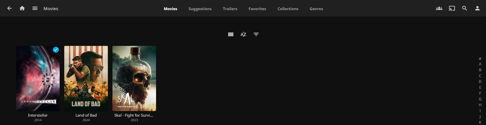
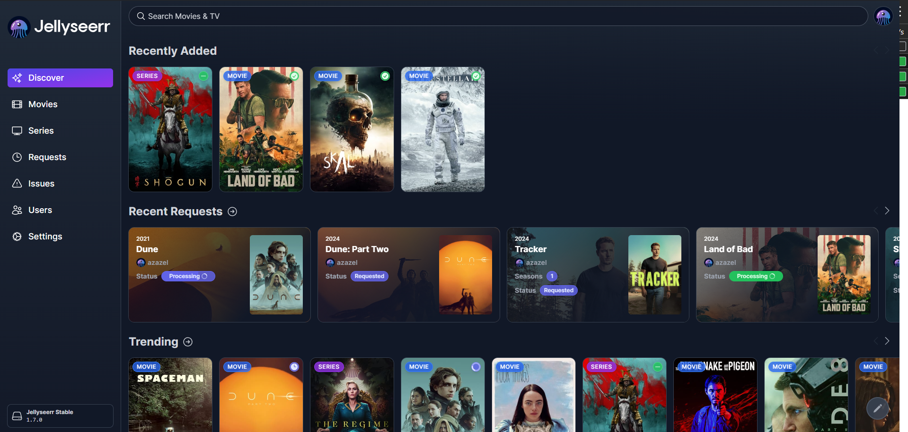
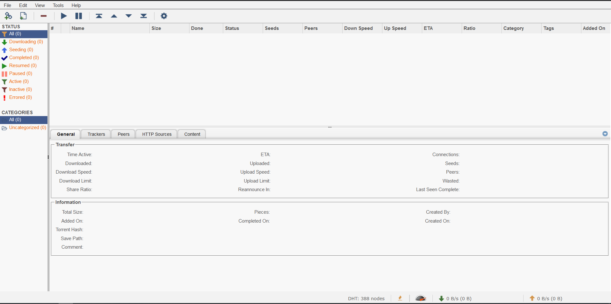
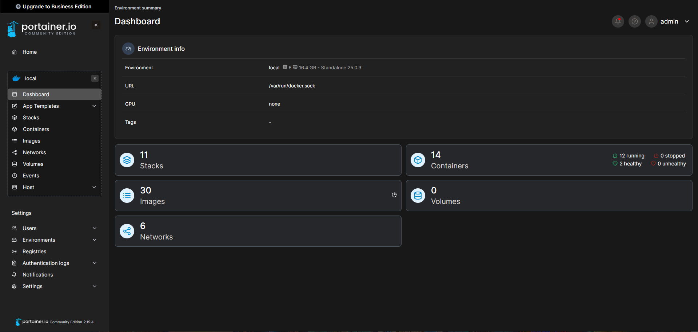
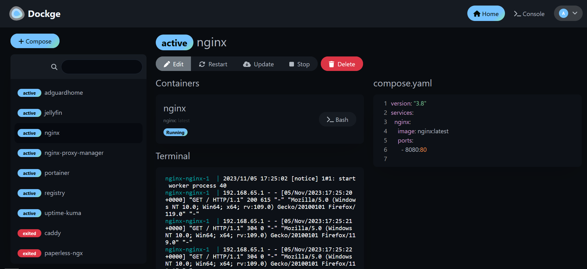
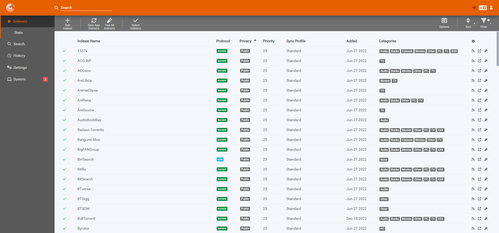
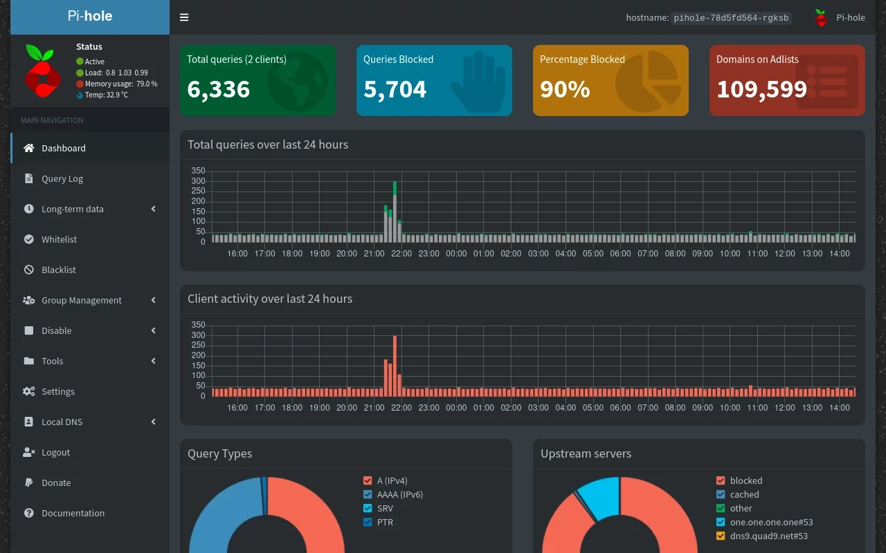
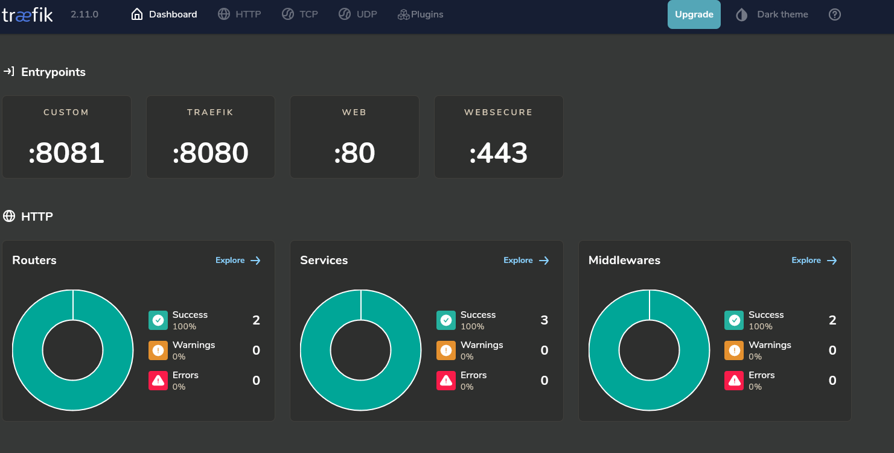

# This repo is about my `Dockerplates`

This Repository **Dockerplates** is my personal docker-compose file collection that I use on my homelab server. Here you can find templates, and configurations for a dashboard for all your services, docker containers and a self hosted media server.

> :warning: Be aware that products change over time. I do my best to keep up with the latest changes and releases in my free time, but please understand that this won’t always be the case.

I created them as free resources to be used in your homelab environment servers if you choose to use them. Keep in mind to tailor them to your specific infrastructure as they do not contain the environment variables or tokens needed to function correctly.

## Showcase
### `Homarr` dashboard

A simple, yet powerful fully customizable dashboard for your server.

### `Jellyfin` media server

Jellyfin is the volunteer-built media solution that puts you in control of your media. Stream to any device from your own server, with no strings attached. Your media, your server, your way.

### `Jellyseerr` media library management tool

Jellyseerr is a free and open source software application for managing requests for your media library. It is a fork of Overseerr built to bring support for Jellyfin & Emby media servers!

### `qBittorrent` torrent client

The Qbittorrent project aims to provide an open-source software alternative to µTorrent. qBittorrent is based on the Qt toolkit and libtorrent-rasterbar library.

### `Portainer` container manager

Portainer is a lightweight service delivery platform for containerized applications that can be used to manage Docker, Swarm, Kubernetes and ACI environments.

### `Dockge` compose file manager

A fancy, easy-to-use and reactive self-hosted docker compose.yaml stack-oriented manager.

### `Uptime Kuma` monitoring tool

A fancy, easy-to-use and reactive self-hosted uptime monitor.

### `Prowlarr` indexer

Prowlarr is a indexer manager/proxy built on the popular arr .net/reactjs base stack to integrate with your various PVR apps. Prowlarr supports both Torrent Trackers and Usenet Indexers. It integrates seamlessly with Sonarr, Radarr, Lidarr, and Readarr offering complete management of your indexers with no per app Indexer setup required.

### `Pi-hole` dns ad blocker

The Pi-hole® is a DNS sinkhole that protects your devices from unwanted content, without installing any client-side software.

### `traefik` reverse proxy

Traefik is a leading modern reverse proxy and load balancer that makes deploying microservices easy. Traefik integrates with your existing infrastructure components and configures itself automatically and dynamically.

## Other Resources

- [Neovide config](https://github.com/somedayitwillend/neovim-config) - My amazing neovide config that I currently use for work.

- [Old dotfiles](https://github.com/somedayitwillend/hyprland_dotfiles) - My personal configuration files for Hyprland linux on arch.

- [Something fun](https://github.com/somedayitwillend/network-traffic-tracker) - Visualize your network traffic.
