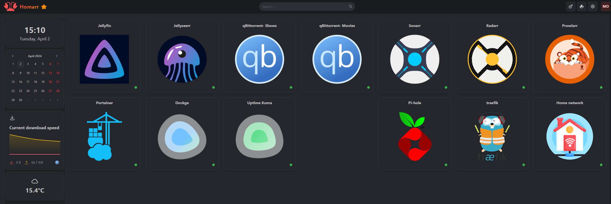

# This repo is about my `Dockerplates`

This Repository **Dockerplates** is my personal docker-compose file collection that I use on my homelab server. Here you can find templates, and configurations for a dashboard for all your services, docker containers, a discord bot for creating images based on your current rio in WoW with a few other functions and a self hosted media server.

> :warning: Be aware that products change over time. I do my best to keep up with the latest changes and releases in my free time, but please understand that this won’t always be the case.

I created them as free resources to be used in your homelab environment servers if you choose to use them. Keep in mind to tailor them to your specific infrastructure as they do not contain the environment variables or tokens needed to function correctly.

## Showcase
### `Homarr` dashboard

A simple, yet powerful fully customizable dashboard for your server.

### `Jellyfin` media server

Jellyfin is the volunteer-built media solution that puts you in control of your media. Stream to any device from your own server, with no strings attached. Your media, your server, your way.

### `Jellyseerr` media library management tool

Jellyseerr is a free and open source software application for managing requests for your media library. It is a fork of Overseerr built to bring support for Jellyfin & Emby media servers!

### `Transmission` torrent client

A Fast, Easy and Free Bittorrent Client

### `Portainer` container manager

Portainer is a lightweight service delivery platform for containerized applications that can be used to manage Docker, Swarm, Kubernetes and ACI environments.

## Other Resources

- [Old dotfiles](https://github.com/somedayitwillend/hyprland_dotfiles) - My personal configuration files for Hyprland linux on arch.

- [Older dotfiles](https://github.com/somedayitwillend/sway-dotfiles) - Old Sway dotfiles for arch before I started using Hyprland.
